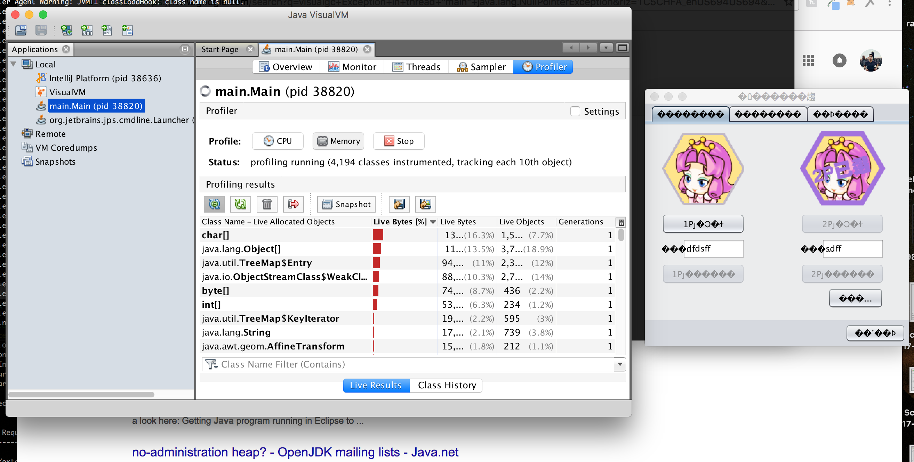
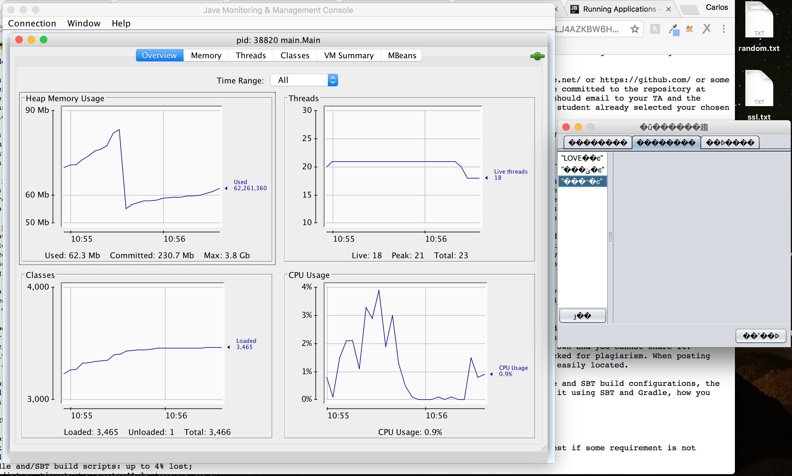
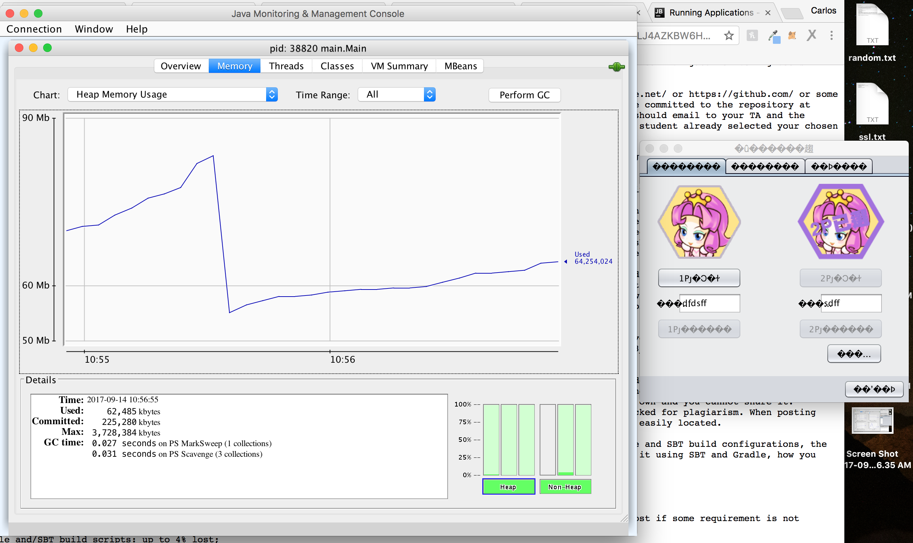
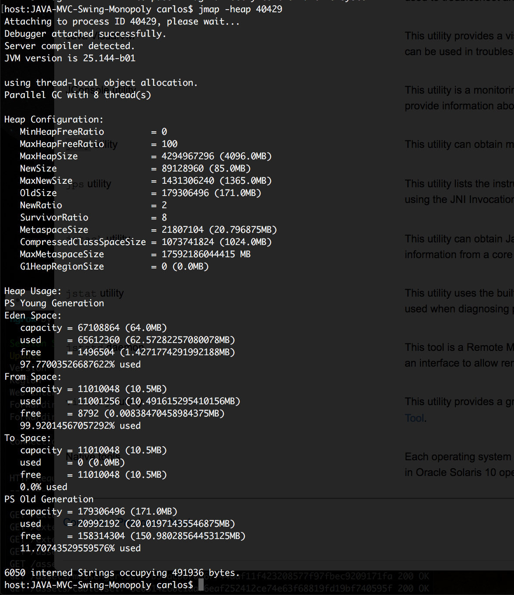
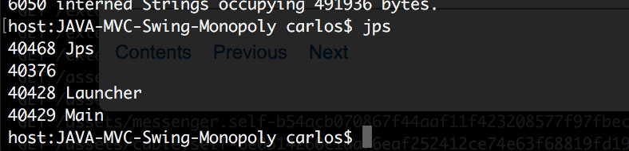

# Java Monitoring Tools #

Using the Java VisualVM utility, we can profile the application to see the objects allocated by the application and the classes allocating those objects.

With jmcd we can get send diagnostic command requests, for example running 
`jcmd 40429 VM.uptime`
gives us the uptime of the JVM in seconds and
`jcmd 40429 Thread.print`

prints all the threads with stack traces

Running jconsole and selecting the local process main.Main shows information regarding performance and resource consumption of the process.  We can see, for example, how the Heap increases as we interact with the app.

jmap shows heap configuration and usage

jps lists all running Java VM on the current system, Main being the one of interest

